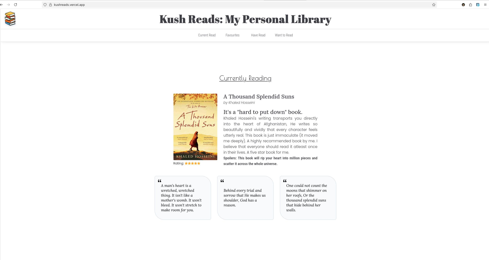
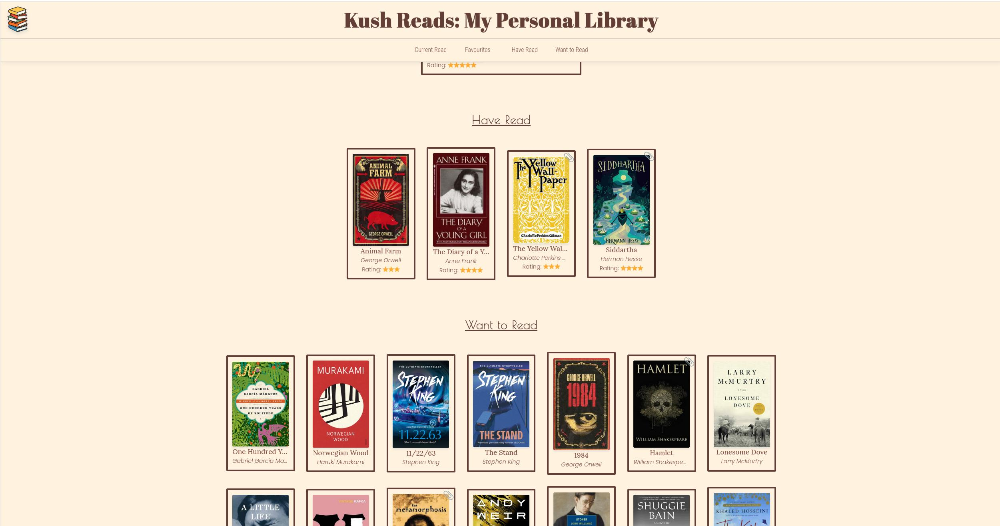

# 📚 Kush Reads  

Kush Reads is my personal library website where I showcase my taste in books. It shows what I am currently reading, have read, some of my favourites with ratings and of course, what I want to read in the future or the books that I have in my physical TBR.

You can even read some public domain book as an EBook by clicking on the books with this -> 📎  emoji on the top right. Public domain books are creative works whose copyrights have expired or were never granted, making them free for anyone to use, copy, distribute, and adapt without permission.

## Project Previews  

  
  
  

## Features  

- **Currently Reading** - Books I’m reading right now with ratings and reviews and some book quotes.  
- **Favourites** - Some of the absolute masterpieces, the books I'd sell my soul to read again for the first time.  
- **Have Read** - Books I’ve completed, with rating and links (for public domain books).  
- **Want to Read** - A growing list of books I want to read in the future.  
- **Public Domain Access** - Free classics linked from Project Gutenberg.  
- **Responsive Design** - Works on desktop and mobile.  

### Why did I create this website?

I just wanted to just track my reading journey. One day, I got an idea when I was reading a book: Why not create a website to keep track of what I am reading, what I've read in the past (other than boring academic books ofcourse), and what some of my favourites are? I also had the idea to include Project Gutenberg links so *you* (the stalkers) can read the public domain books online for free. There are tons of classic books out there that are in public domain so they can be read for free online.  
